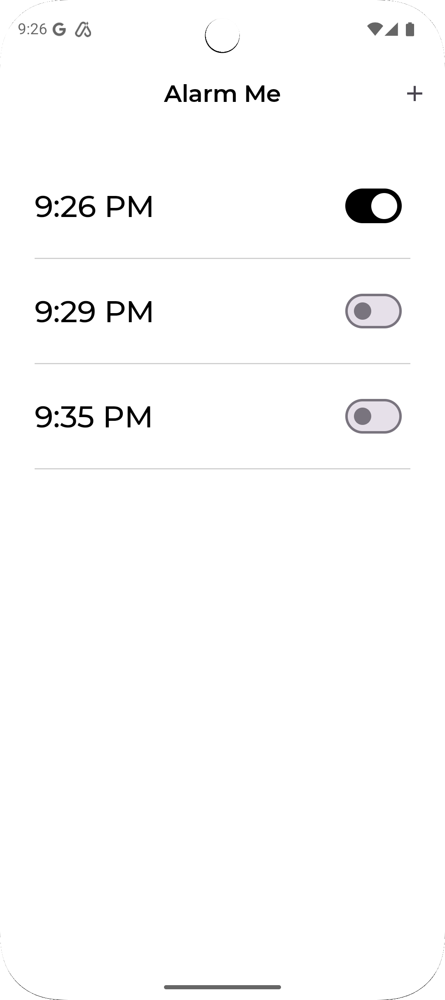
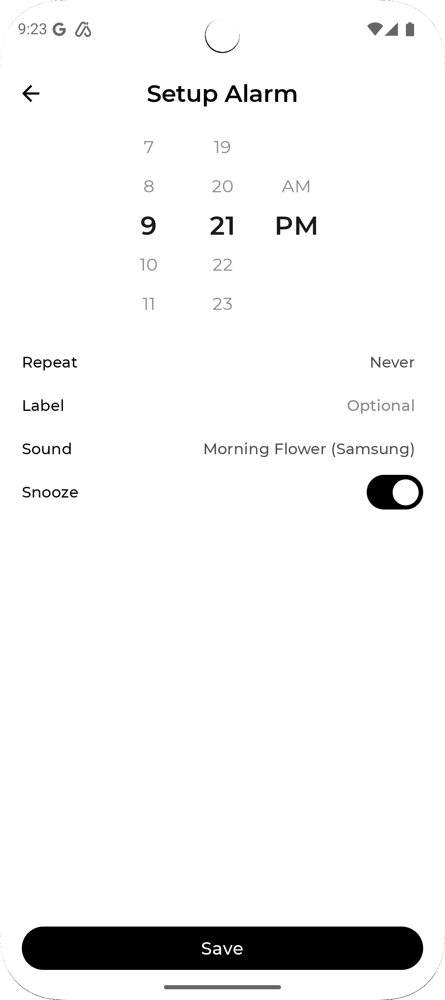
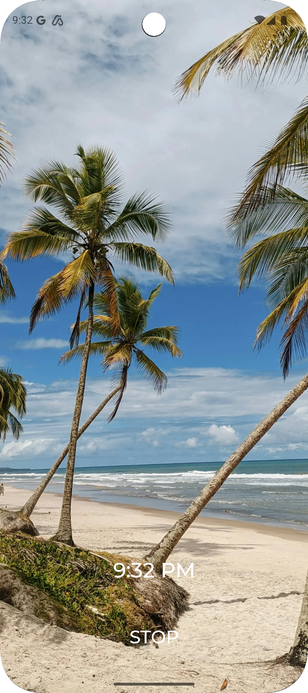

[](https://app.bitrise.io/app/5b770be4-c4df-4d2c-8172-14153a7d9f78)

# Alarm Me Android

https://github.com/longdt57/Alarm-Me

## Screenshots

| Alarm List                                         | Alarm Setup                                         | Alarm Trigger                                         |
|----------------------------------------------------|-----------------------------------------------------|-------------------------------------------------------|
|  |  |  |

## Setup

- Clone the project
- Run the project with Android Studio

## Linter and static code analysis

- Lint:

```
$ ./gradlew lint
```

Report is located at: `./app/build/reports/lint/`

- Detekt

```
$ ./gradlew detekt
```

Report is located at: `./build/reports/detekt`

## Testing

- Run unit testing:

```
$ ./gradlew app:testStagingDebugUnitTest
```

- Run unit testing with coverage:

```
$ ./gradlew :app:koverHtmlReport
```

Report is located at: `app/build/reports/kover/`

## Build and deploy

For `release` builds, we need to provide release keystore and signing properties:

- Put the `release.keystore` file at root `config` folder.
- Put keystore signing properties in `signing.properties`

### Firebase

- Add google-credentials-firebase-distribution.json to the the project
- Gradlew: Run command `sh tools/app-distribution.sh` to upload the app to Firebase
